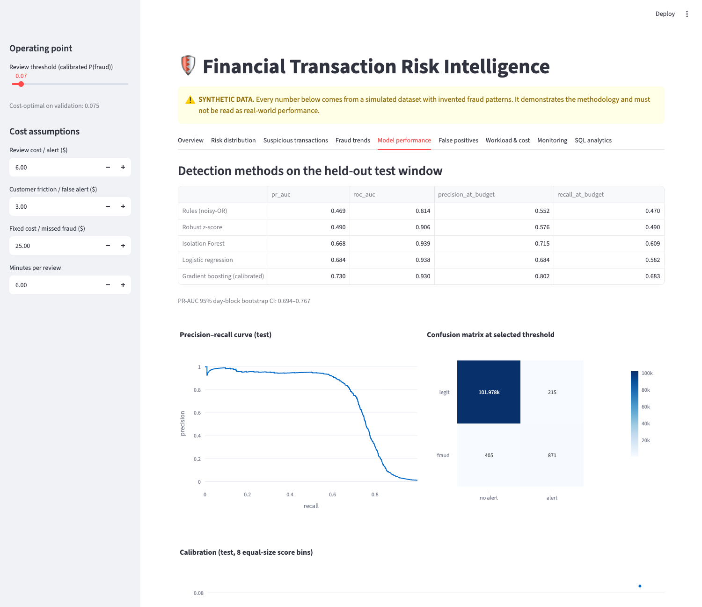
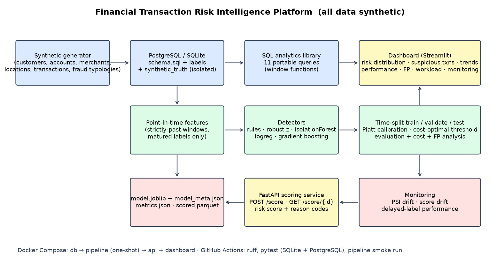

# Financial Transaction Risk Intelligence Platform

[](https://github.com/5exclamations/fintech-risk-intelligence/actions/workflows/ci.yml)

End-to-end reference implementation: synthetic transaction data → PostgreSQL/SQL analytics → leakage-safe feature engineering →
rules + statistical + ML fraud detection → rigorous time-based evaluation with business-cost analysis → explainable risk-scoring API →
Streamlit dashboard → drift/performance monitoring. Python · PostgreSQL · SQL · pandas · NumPy · scikit-learn · FastAPI · Streamlit · Docker · pytest · GitHub Actions.

> ## ⚠️ Synthetic-data demonstration — not a production fraud decision system
> Do not use this code, model or API to make real fraud, credit, or account decisions. See [limitations](docs/limitations.md) and [API security](docs/api_security.md).
>
> ### Synthetic results ≠ real-world performance
> All data is simulated with invented fraud typologies (see [assumptions](docs/synthetic_data_assumptions.md)). Every metric here shows that the *method* works
> on a world whose rules the author wrote; it says nothing about how the model would perform on real transactions. The dashboard, API responses, model metadata and pipeline output
> all carry this disclaimer. Synthetic-only diagnostics (e.g. recall per fraud pattern) use generator ground truth, which does not exist in real life.

## Headline results (synthetic, held-out test window, 75 days / 103k transactions)
| | Rules | Robust z | IsolationForest | LogReg | **Gradient boosting** |
|---|---|---|---|---|---|
| PR-AUC | 0.469 | 0.490 | 0.668 | 0.684 | **0.730** (95% CI 0.694–0.767) |

At the validation-chosen threshold: **precision 80.2% · recall 68.3% · F1 0.74 · false-positive rate 0.21% · ~14 alerts/day (≈0.2 analyst)**.
The test window includes a fraud pattern the model never saw: recall on it is only **21%**, which is the point of the monitoring and honesty sections.
Full discussion: [modeling methodology](docs/modeling_methodology.md), [model card](docs/model_card.md).



## Architecture


Details: [docs/architecture.md](docs/architecture.md).

## Quick start
```bash
make setup                 # venv + dependencies
make all                   # generate -> SQLite -> SQL analytics -> train/evaluate -> monitoring   (~1 min)
make test                  # unit/integration/leakage/reproducibility tests (PostgreSQL test runs when DATABASE_URL is a postgresql:// URL, always in CI)
RISK_FULL_REPRO=1 pytest tests/test_reproducibility.py   # full-scale run must reproduce the headline numbers
make dashboard             # http://localhost:8501
make backtest              # rolling-origin backtest (~5 min) -> artifacts/backtest.json
make api                   # http://localhost:8000/docs  (key: RISK_API_KEY, default dev-demo-key)
```
PostgreSQL + everything via Docker: `docker compose up --build` (db → pipeline job → API :8000 + dashboard :8501).
**Windows (PowerShell):** `.\scripts\dev.ps1 setup; .\scripts\dev.ps1 all; .\scripts\dev.ps1 test; .\scripts\dev.ps1 api` (Python 3.12 recommended; see [robustness & reproducibility](docs/robustness_and_reproducibility.md)).

Or point any run at your own Postgres: `DATABASE_URL=postgresql+psycopg://user:pw@host/db python -m riskplatform.pipeline all`.

Try the API:
```bash
curl -H 'X-API-Key: dev-demo-key' localhost:8000/score/T0300000                       # replay a stored transaction (history strictly before it)
curl -X POST localhost:8000/score -H 'X-API-Key: dev-demo-key' -H 'content-type: application/json' -d '{
  "customer_id":"C00001","account_id":"A000002","merchant_id":"M00479","location_id":22,
  "amount":250.0,"channel":"online","device_id":"NEW-DEVICE-1"}'
```

## Repository map
| Path | Contents |
|---|---|
| `riskplatform/` | `generate`, `db`, `analytics`, `features`, `rules`, `anomaly`, `modeling`, `evaluation`, `explain`, `monitoring`, `pipeline`, `api` |
| `sql/schema.sql`, `sql/analytics/` | DDL and 11 portable analytical queries (verified on PostgreSQL 17 and SQLite) |
| `dashboard/app.py` | Streamlit dashboard (9 tabs; interactive threshold & cost sliders) |
| `tests/` | feature leakage, time-split, SQL, evaluation maths, PSI, API parity tests |
| `.github/workflows/ci.yml` | ruff, pytest (SQLite + Postgres service), pipeline smoke run |
| `docs/` | [limitations](docs/limitations.md) · [API security](docs/api_security.md) · [business case](docs/business_case.md) · [data dictionary](docs/data_dictionary.md) · [synthetic assumptions](docs/synthetic_data_assumptions.md) · [SQL examples](docs/sql_examples.md) · [methodology](docs/modeling_methodology.md) · [model card](docs/model_card.md) · [risk scoring](docs/risk_scoring.md) · [monitoring](docs/monitoring.md) · [architecture](docs/architecture.md) · [screenshots](docs/screenshots) · [robustness & provenance](docs/robustness_and_reproducibility.md) · [verification status](docs/verification.md) |

## Design highlights
* **Leakage control is tested, not asserted**: truncating/shuffling the table must not change any earlier row's features; labels are used only after a 14-day maturity delay; splits leave maturity gaps; the generator's ground truth lives in separate tables.
* **No training/serving skew**: the API runs the identical feature code and its replay score equals the offline score (test).
* **Cost-based decisions**: threshold = argmin business cost on validation; workload (alerts/day, analyst FTE) is first-class.
* **Robustness & provenance**: rolling-origin backtest (PR-AUC 0.68 ± 0.07 across 4 origins, synthetic), slice/disparity screen, Brier/ECE, and a run manifest (git SHA, data hash, config hash, library versions) — [details](docs/robustness_and_reproducibility.md).
* **Honest evaluation**: day-block bootstrap CI, per-method comparison at equal alert budget, false-positive breakdowns, calibration, drift period inside the test window.

## Known limitations
See [docs/limitations.md](docs/limitations.md). In short: synthetic signal is cleaner than reality; cost figures are invented; single simulated year and seed; reason codes are occlusion-based approximations; API security is demo-grade (API key + rate limit, no TLS/users/audit log); the API keeps full history in memory (fine for a demo, not for production scale – use a feature store).
