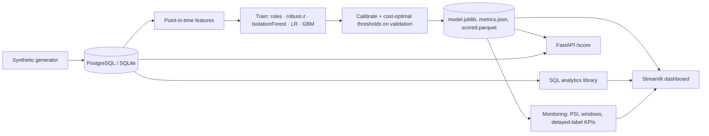

# Architecture

| Module | Responsibility |
|---|---|
| `generate.py` | synthetic entities, transactions, fraud injection, label noise |
| `db.py`, `sql/` | schema, loading, portable analytics SQL |
| `features.py` | leakage-safe feature engineering shared by training and serving |
| `rules.py`, `anomaly.py`, `modeling.py` | detectors, training, calibration, thresholds |
| `evaluation.py`, `explain.py` | metrics / cost / FP analysis; reason codes |
| `monitoring.py` | PSI drift and performance windows |
| `pipeline.py` | CLI orchestration (`generate`, `analytics`, `train`, `all`) |
| `api.py`, `dashboard/app.py` | serving and visualisation |

Deployment (`docker-compose.yml`): `db` (Postgres 16) → `pipeline` (one-shot job) → `api` (:8000) + `dashboard` (:8501), sharing an artifacts volume.
